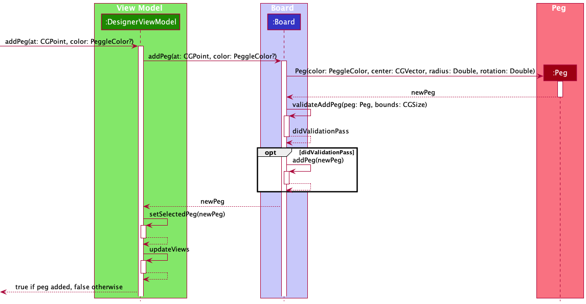
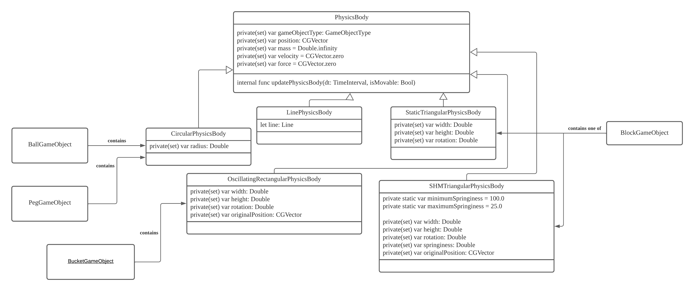

# Developer Guide

Note that all diagrams in this section do not follow the UML notation strictly and have irrelevant details omitted.

### File organization

This section will go through the various folders in the `PeggleClone` project in detail.

#### Models

Models holds data and ensures that the application state is valid. It does not interact with any other layers and it does not know about the existence of the other layers.

The `Peg` model represents a peg in the game. It stores the id, color, center and rotation. A `Peg` is a circular object with a constant radius and some rotation.

The `TriangularBlock` model represents a triangular block in the game. It stores the id, color, center, width, height, rotation and springiness. A `TriangularBlock` can be either static or springy depending on the springiness level. Springiness level that is equal to zero represents a non-springy block.

The `Board` model represents a board/level in the game. It stores the id, name as well as the pegs and triangular blocks it currently contains. A screenshot of the board is also saved as binary data.

The `Board` model has a one-to-many relationship with the `Peg` model and the `TriangularBlock` model. The board contains a pegs array and a blocks array. The `Board` model also is responsible for the validation of game state. For example, when a peg is added, the board model should ensure that the peg is not overlapping with another peg. Therefore, a `Board` model will always represent a valid game state and is ultimately responsible for maintaining it.

In summary, the `Models` are the single-source of truth of data in this project.

Bellow is a class diagram that summarizes everything above.

#### Views

Views, written using SwiftUI, contains code that generates the different views that a user sees. To make sure that the views are isolated and does not concern itself with business logic, all actions by the views are done by a view model.

A view model is an intermediary that contains the business logic and will be explained in the next section.

Views, therefore, only contain UI specific logic.

Bellow is the view hierarchy in a diagram form. Note that only important views are shown in this diagram. Many helper and sub-views are omitted.

#### ViewModels

View Models contains functions that update the model. These functions are called by the view.

For example, when the user taps the board, the `addPeg(at point: CGPoint, color: PegColor?)` in the `DesignerViewModel` is called which then updates the game state by updating the model. Once the state has changed, the view model also updates the view.

#### Persistence

Persistence folder contains all core data related methods/functions and extensions.

The `CoreDataManager` is a singleton that contains the core data container that is used throughout the application. It is a singleton as there should be only one such container in the application at any given time. Note that if the core data store is not able to load, it will crash the application with a `fatalError`.

`Peg+Persistable`, `Board+Persistable`, `TriangularBlock+Persistable` are extensions to the `Peg`, `Model`, `TriangularBlock` model objects that help convert between the models in the application and the core data entities that are used for persistence.

#### Extensions

This folder contains general extensions to classes that do not belong anywhere else.

#### Utils

This folder contains utility classes.

Sounds and seed data also reside in this folder.

SoundManager is a singleton that is responsible for playing the different sound effects in the game.

### High-level architecture

The above diagram shows the very high level architecture of the application.

The view models owns models and makes changes to them when needed. The views owns view models that they call methods on after some UI event (button click).

When the state of the model changes, the view model which conforms to the `ObservableObject` protocol will send a notification to all its observers to update themselves. In this case, the views the owns the view models are also observing these view models. Therefore, the view will update themselves when it receives the notification.

The view model also saves the application data to the data layer and also is responsible for loading the data from this data layer.

To better understand this architecture, we will go through a sample application flow.

When a user taps the game palette with the blue peg selected, the tap event causes the view to call the `addPeg` method in the `DesignerViewModel`. The view model then updates the board object by calling `addPeg` method in the `Board` model.

The `addPeg` method in the `Board` model will validate whether this new peg is valid (i.e. not out of bounds, not overlapping with other pegs) and adds it to the pegs array if it passes the validations.

The view model then calls `self.objectWillChange.send()` which causes all views that are currently observing the view model to update itself, triggering an UI update.

To better understand the above, refer to this sequence diagram.

The main bulk of logic for this project resides in the game and physics engines.

Let's look at a more detailed class diagram that is specific to the game and physics engines. Note that we will not be following the UML notation strictly and some attributes and methods are omitted which are not relevant in understanding the high-level architecture.

The `GameViewModel` contains the `board` object that a user has created which is loaded when the user taps the `Play` button. The view model owns a `PeggleGameEngine` object that houses all peggle specific methods and attributes. The `PeggleGameEngine` owns the `PhysicsWorld` object which is part of the physics engine which does not have any peggle specific logic but does all physics logic.

There are several classes that are omitted here. However, we will look at some omitted classes to better understand the properties and their roles.

GameObjects like `BallGameObject`, `PegGameObject`, `BlockGameObject` and `BucketGameObject` are objects that are initialized in the peggle game engine using the `board` model data.

Each game object will contain a physics body according to its shape. These physics bodies will be added into the physics world for simulation.

To understand how the application works, we will look at a sequence diagram. Note that we will not be following the UML notation strictly here too.

The `GameViewModel` sets up the game loop. The game loop is implemented using `CADisplayLink`. The display link will call the `step()` function many times depending on the display's refresh rate.

When the `step()` function is called, the physics engine is invoked to simulate the physics through the peggle game engine.

After simulation, and after all collisions have been resolved, the peggle game engine will update the game object position and other peggle specific logic before updating the views.

Peggle specific logic includes things like applying powerups, removing ball when it exits, removing lit objects when ball exits, etc.

Finally, the `GameView` which observes the `GameViewModel` will be updated causing the UI refresh.
